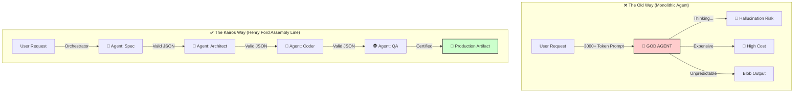

# KairosFlow – Multi‑Agent Prompt Framework for Production

Build boring, deterministic LLM assembly lines instead of fragile 3k‑token god prompts.

<a href="https://www.youtube.com/watch?v=4RhXtpuRK-w" target="_blank">
  
</a>

> Design, run, and debug multi‑agent LLM pipelines with a single JSON artifact standard, zero system‑level hallucinations, and 79–88% prompt complexity reduction measured in real products.

---

## TL;DR

- **Enterprise‑grade multi‑agent framework** for production LLM systems, not another toy “agent demo”.  
- **GranularArtifactStandard**: one JSON contract for every agent, with backend‑owned metadata and strict validation at each hop.  
- **Battle‑tested** in commercial products (marketing pipelines and a WordPress plugin factory) with 79–88% reduction in prompt complexity and task success rates up to ~95% on complex workflows.  
- **Model‑agnostic**: OpenAI, Anthropic, DeepSeek, Gemini, and custom providers behind a single LLM interface.  
- **CLI‑first DX**: `kairos init`, `kairos run`, `kairos validate`, plus a dashboard to inspect pipelines and artifacts in real time.  

If you are building serious LLM systems, **star this repo** and steal the patterns.

---

## Why KairosFlow?

Most AI stacks start from a single “god prompt” and end up with a 3,000+ token blob that nobody can reason about, debug, or scale safely.  
KairosFlow applies the Henry Ford assembly‑line principle to LLMs: one agent, one responsibility, validated at every step.


```mermaid
graph TD
    subgraph "❌ The Old Way (Monolithic Agent)"
        U1[User Request] -->|3000+ Token Prompt| G[🤖 GOD AGENT]
        G -->|Thinking...| H[🤯 Hallucination Risk]
        G -->|Expensive| D[💸 High Cost]
        G -->|Unpredictable| O1[Blob Output]
    end

    subgraph "✅ The Kairos Way (Henry Ford Assembly Line)"
        U2[User Request] -->|Orchestrator| P1[👷 Agent: Spec]
        P1 -->|Valid JSON| P2[👷 Agent: Architect]
        P2 -->|Valid JSON| P3[👷 Agent: Coder]
        P3 -->|Valid JSON| P4[🕵️ Agent: QA]
        P4 -->|Certified| O2[💎 Production Artifact]
    end
    
    style G fill:#ffcccc,stroke:#333,stroke-width:2px
    style O2 fill:#ccffcc,stroke:#333,stroke-width:2px
```

**Core idea**

- Replace monolithic prompts with **pipelines of 2–15 specialized agents**, each with a small, focused prompt aligned to a single role.  
- Normalize all communication through **GranularArtifactStandard v1.0.0** – a single JSON envelope with input, output, metadata, and validation checks.  
- Let the **backend own all system metadata** (timestamps, status, IDs, metrics), so agents only produce business payloads and cannot hallucinate infrastructure fields.  

The result is a pipeline that feels like standard software engineering: traceable, testable, and predictable instead of “prompt alchemy”.

---

## Proven results (real KPIs)

KairosFlow was extracted from real products and refined until the numbers were defensible in front of a CTO or a client.

### 1. Kairos Creative V2 – Marketing pipelines

- **Domain:** marketing campaigns and copy generation.  
- **Agents:** 4 specialized roles (strategy, writer, SEO, QA) in sequence.  
- **Tokens:** roughly **75% reduction** in tokens per campaign compared to a single‑prompt baseline.  
- **Quality:** internal evaluation scores improved from ~65 to ~90 after moving to the multi‑agent pipeline.  
- **Cost:** around **$0.01 per campaign** when using cost‑efficient models like DeepSeek in the factory setup.  

### 2. Kairos WP – WordPress plugin factory

- **Domain:** generation of production‑grade WordPress plugins (PHP + JS).  
- **Agents:** up to **15 specialized agents** (PM, architect, multiple coders, QA, etc.).  
- **Prompt complexity:** about **88% reduction** (from a single ~3,500‑token prompt to multiple ~400‑token prompts chained via artifacts).  
- **Success rate:** complex tasks increased from ~40% reliable completion to roughly **95%** once the assembly‑line architecture was in place.  

### 3. Platform‑level gains

- **Complexity reduction:** 79–88% less prompt surface area to maintain versus giant system prompts.  
- **Debug time:** typical issues can be isolated in ~30 minutes because every step leaves a structured artifact trail.  
- **Reuse:** up to ~80% of agents and templates can be reused across projects and domains once the pipeline patterns are in place.  

---

## Key concepts

### GranularArtifactStandard

A single JSON schema that every agent reads and writes.

Each artifact includes:

- Core fields such as `agent_id`, `agent_name`, `responsibility`, `input`, and `output`.  
- A **metadata** block injected by the CLI/backend (timestamps, status flags, execution stats) that agents never touch.  
- A **validation** block (implemented with Zod) that records checks performed and whether the artifact is considered valid for downstream steps.  

This makes every hop in the pipeline observable, replayable, and easy to inspect from the CLI or the dashboard.

### Context Orchestrator

A dedicated orchestrator decides how context flows through the pipeline instead of dumping global state into every prompt.

It controls:

- Which artifacts and fields each agent sees as context.  
- How much history to inject (minimal by default to avoid cognitive and token bloat).  
- The execution order, branching, and failure handling between agents.  

This design removes the need to stuff entire conversation logs and configs into a single LLM call.

### Henry Ford pipeline

Instead of “one LLM does everything”, a typical pipeline looks like:

- **Software:** spec → architecture → code → QA.  
- **Marketing:** strategy → draft copy → SEO optimization → QA.  

Pipelines scale from 2 to 15 agents without changing the core architecture or artifact contract.

---

## Quickstart

Install the CLI globally:

```
npm install -g kairos-flow
```

Initialize a new factory:

```
kairos init my-factory
cd my-factory
```

Run your first pipeline:

```
kairos run
```

During `kairos init` you will:

- Select your **LLM provider** (OpenAI, Anthropic, DeepSeek, Gemini, or a custom OpenAI‑compatible endpoint).  
- Configure API keys via environment variables instead of hard‑coding secrets.  

Artifacts produced by each run are stored as JSON and can be explored through the CLI or the dashboard.

---

## Example: simple multi‑agent pipeline

KairosFlow ships with templates you can adapt directly to your own domain.

A minimal “software factory” pipeline:

1. **Spec Agent** – turns a vague user request into a structured, machine‑readable specification.  
2. **Architect Agent** – converts the spec into a plan of files, modules, and responsibilities.  
3. **Coder Agent** – generates implementation code for each planned unit.  
4. **QA Agent** – reviews the outputs, flags issues, and proposes fixes before you ship.  

Each step exchanges a validated artifact, which lets you:

- Inspect exactly what each agent received and produced.  
- Add or remove agents without rewriting the rest of the pipeline.  
- Re‑run only the failing steps when validation fails instead of re‑invoking the whole chain.

---

## Features

### Production‑ready architecture

- **TypeScript + Node.js** core with strict compiler settings and predictable builds.  
- **Zod schemas** for runtime validation and automatic TypeScript inference.  
- **Commander‑based CLI** exposing `init`, `run`, and `validate` commands out of the box.  

### Model‑agnostic LLM layer

- Unified `LLMProvider` interface and `LLMFactory` to instantiate different backends from one config.  
- Built‑in providers for OpenAI (GPT‑3.5/4), Anthropic Claude, DeepSeek via OpenAI‑compatible API, Google Gemini, and custom endpoints.  
- JSON‑first prompting patterns for tool‑like, schema‑constrained outputs.  

### Testing, CI, and deployment

- **Jest + ts‑jest** configured and running unit tests against the core schema and CLI.  
- **GitHub Actions** workflow that builds and tests on every push/PR for main Node versions.  
- Ready for Dockerization and integration into your internal AI platform (base Dockerfile patterns are already defined in the docs).  

### Dashboard and observability

- Web dashboard MVP to visualize pipeline progress in real time and browse generated artifacts.  
- CLI command (e.g. `kairos dashboard`) to launch the UI and connect it to your local runs.  
- Metrics layer designed for throughput, token usage, and agent‑level performance, with hooks planned for Prometheus, Grafana, and Sentry integrations.  

### Extensibility

- Plugin system with lifecycle hooks such as `onPipelineStart`, `onAgentStart`, and `onAgentFinish` so you can add logging, notifications, or custom logic without touching the core engine.  
- Support for local and npm‑distributed plugins managed by a centralized loader.  
- Template system for domain‑specific pipelines (software development, content generation, data analysis, marketing campaigns, and more).  

---

## Who is this for?

KairosFlow targets teams and individuals who have already felt the pain of “just tweak the system prompt again”.

Typical users:

- **Senior AI / ML engineers** and **technical leads** responsible for delivering LLM systems into production.  
- **Consultancies and agencies** that need reusable pipelines (copy, codegen, analytics) that they can roll out across clients.  
- **Product and startup teams** that need production‑grade architecture and compliance‑friendly traceability without hiring a full AI platform team.  

If this sounds like your context, KairosFlow gives you a methodology and a framework, not just a random bag of helpers.

---

## Roadmap

**Short‑term (v1.x)**

- Additional ready‑to‑run templates for common production use cases.  
- More examples with real prompts, tests, and sample data.  
- UX polish for plugin system and dashboard based on early adopters’ feedback.  

**Mid‑term (v2.x)**

- Marketplace of pre‑built agents and pipelines.  
- Cloud deployment recipes (Docker, Kubernetes, serverless patterns).  
- Advanced analytics and monitoring integrations for agent‑level KPIs.  

See the issue tracker for what is currently being designed and implemented.

---

## Contributing

Contributions are welcome:

1. **Star** this repo if the ideas are useful to you – it helps others discover the framework.  
2. Open an **issue** with your use cases, questions, or bug reports.  
3. Send **PRs** with new templates, documentation improvements, or provider integrations.  

KairosFlow is open source, with a clear path toward commercial add‑ons (agents, templates, and services) for teams that need extra support.
