# 🚀 KAIROS FLOW

> **The "Henry Ford" Framework for Production AI.**  
> Reduce tokens by **88%** and eliminate hallucinations via granular architecture.

[](https://opensource.org/licenses/MIT)
[](https://www.typescriptlang.org/)
[](https://deepseek.com)
[](CONTRIBUTING.md)

---

## 📉 Why KairosFlow? (Evidence-First)

We don't sell "magic". We sell **Engineering**.

| Metric | Impact | Proven In |
| :--- | :--- | :--- |
| **88% Cost Reduction** | Replaced 3.5k token "God Prompts" with 5x 400 token atomic prompts. | **Kairos WP** (Production) |
| **Zero Hallucinations** | System metadata is injected by Backend, never generated by LLM. | **Kairos Creative** (Production) |
| **$0.05 / Day** | Full 15-agent pipeline running on DeepSeek V3. | **Internal Benchmarks** |

---

## 🆚 The Paradigm Shift

Most frameworks let LLMs "figure it out". **KairosFlow is an assembly line.**

```mermaid
graph TD
    subgraph "❌ The Old Way (Monolithic Agent)"
        U1[User Request] -->|3000+ Token Prompt| G[🤖 GOD AGENT]
        G -->|Thinking...| H[🤯 Hallucination Risk]
        G -->|Expensive| D[💸 High Cost]
        G -->|Unpredictable| O1[Blob Output]
    end

    subgraph "✅ The Kairos Way (Henry Ford Assembly Line)"
        U2[User Request] -->|Orchestrator| P1[👷 Agent: Spec]
        P1 -->|Valid JSON| P2[👷 Agent: Architect]
        P2 -->|Valid JSON| P3[👷 Agent: Coder]
        P3 -->|Valid JSON| P4[🕵️ Agent: QA]
        P4 -->|Certified| O2[💎 Production Artifact]
    end
    
    style G fill:#ffcccc,stroke:#333,stroke-width:2px
    style O2 fill:#ccffcc,stroke:#333,stroke-width:2px
```



---

## 🛠️ The Engineering (No Magic)

We don't trust the LLM to "be good". We enforce it with **Zod** and **TypeScript**.
Every artifact passing between agents must satisfy the **GranularArtifactStandard**.

### The "Zero-Hallucination" Schema
The backend injects the `metadata` and `validation` fields. The Agent is **physically unable** to hallucinate them because it never touches them.

```typescript
// src/schemas/artifact.ts
export const GranularArtifactSchema = z.object({
  agent_id: z.string(),
  agent_name: z.string(), 
  responsibility: z.string(),
  input: z.record(z.any()),
  output: z.union([z.record(z.any()), z.string(), z.array(z.any())]),
  // 🛡️ INJECTED BY SYSTEM (LLM CANNOT TOUCH)
  metadata: z.object({
    timestamp: z.string().datetime(),
    status: z.enum(['success', 'error', 'pending'])
  }),
  // 🛡️ VALIDATED BY ZOD
  validation: z.object({
    is_valid: z.boolean(),
    checks_passed: z.array(z.string())
  })
});
```

---

## 🏭 Born in Production

KairosFlow isn't a weekend experiment. It was extracted from live, commercial systems enabling high-margin AI workflows.

> **"Validated in commercial environments: Kairos Creative V2 (Marketing) & Kairos WP (Software Dev)"**

---

## ⚡ Quick Start

### 1. Initialize
```bash
npx kairos-flow init my-factory
cd my-factory
```

### 2. Configure (DeepSeek Example)
`kairos.config.json`:
```json
{
  "llm": {
    "provider": "deepseek",
    "model": "deepseek-chat",
    "apiKey": "${DEEPSEEK_API_KEY}"
  },
  "plugins": ["./plugins/my-logger"]
}
```

### 3. Run
```bash
npx kairos-flow run
```
*Watch the assembly line go to work.*

---

## 💎 The "Secret Sauce"

### 1. Zero-Hallucination Metadata ™
**Stop asking LLMs to do system work.**
In KairosFlow, the Agent (LLM) is **forbidden** from generating metadata. It only generates the `output` payload. The CLI (Backend) wraps it in a `GranularArtifact` with cryptographically secure IDs, timestamps, and execution stats.

### 2. The DeepSeek Factory ($0.05/day)
We've optimized the architecture to work perfectly with **DeepSeek V3/R1**.
- **Native JSON Mode:** Enforced at the provider level.
- **Granular Prompts:** Small, focused prompts (<1k tokens) mean you can run complex 15-agent pipelines for pennies.

### 3. Plugin Ecosystem 🔌
Don't touch the core. Extend it.
- **Hooks:** `onPipelineStart`, `onAgentFinish`, `onInit`.
- **Use Cases:** Log to Datadog, push to Slack, commit to Git.

---

## 🤝 Join the Revolution

We are building the standard for **Deterministic AI Engineering**.

- **[⭐ Star the Repo](https://github.com/JavierBaal/KairosFlow)** (It helps!)
- **[📖 Read the Docs](docs/)**
- **[🐛 Report Issues](https://github.com/JavierBaal/KairosFlow/issues)**

> *Built with ❤️ by [Javier Baal](https://x.com/javierbaal00). Powered by the Henry Ford Principle.*
